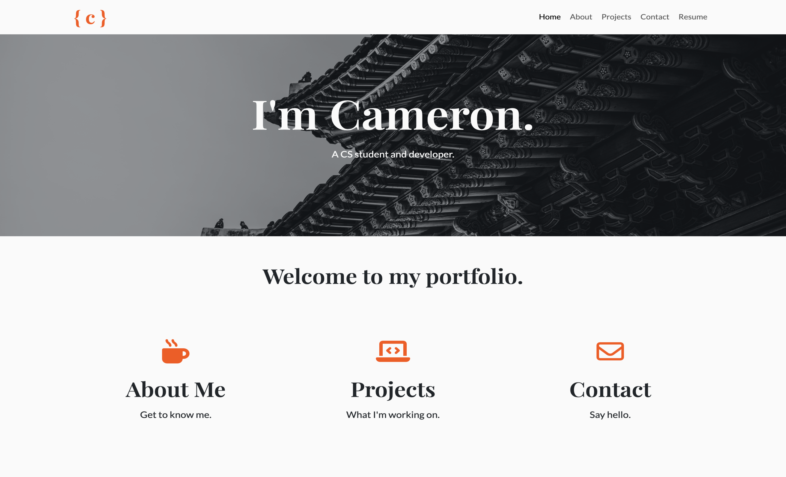

# My Portfolio Website

Welcome to my portfolio website! 
This repository contains the source code for my personal portfolio website, showcasing my projects and skills as a software developer.

## Overview

This website is built using Python with the Flask framework for the backend and HTML, Bootstrap CSS for the frontend. 
The site includes various sections such as an about page, projects page, contact page, and a resume page. 
It also features a contact form with email functionality for visitors to get in touch with me.

## Technologies Used

- Python
- Flask
- HTML
- Bootstrap CSS
- Git
- GitHub
- AWS

## Deployment

The website is hosted on AWS Elastic Beanstalk for optimal scalability and high availability. 
The deployment process is automated using AWS CodePipeline, ensuring continuous integration and deployment of the latest changes from this GitHub repository.

## Challenges

Throughout the development of this portfolio website, I faced challenges related to setting up the deployment environment on AWS Elastic Beanstalk and establishing the CI/CD CodePipeline. 
I had to learn how to manually create a new user and role for AWS to properly establish the Elastic Beanstalk environment. 
Additionally, I needed to configure the environment properties securely to protect sensitive information and maintain email functionality on the contact page.

Thank you for visiting my portfolio website!

---

© Cameron Chafin | *2023* | All Rights Reserved
